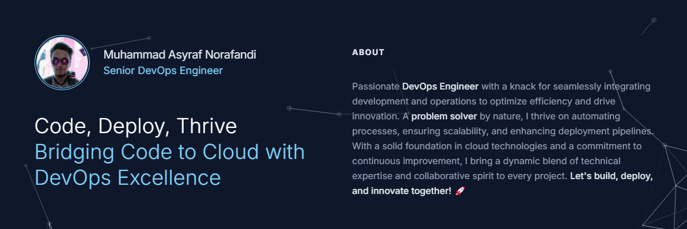

<div align="center">
  <br />
    <a href="https://astar.network/" target="_blank">
      
    </a>
  <br />

  <div>
    
    
  </div>
</div>

## 📋 Table of Contents

[](https://github.com/asyrafnorafandi/asyrafnorafandi.dev/actions/workflows/tests.yml)

1. 🚀 [Quick Start](#quick-start)
2. 📜 [License](#license)
3. 🧐 [Author Information](#author)

## 🚀 <a name="quick-start">Quick Start</a>

First, run the development server:

```bash
npm run dev
# or
yarn dev
# or
pnpm dev
# or
bun dev
```

Open [http://localhost:3000](http://localhost:3000) with your browser to see the result.

You can start editing the page by modifying `app/page.tsx`. The page auto-updates as you edit the file.

This project uses [`next/font`](https://nextjs.org/docs/basic-features/font-optimization) to automatically optimize and load Inter, a custom Google Font.

## 📜 <a name="license">License</a>

MIT / BSD

## 🧐 <a name="author">Author Information</a>

This website was created in 2024 by [Asyraf Norafandi](https://www.github.com/asyrafnorafandi)
